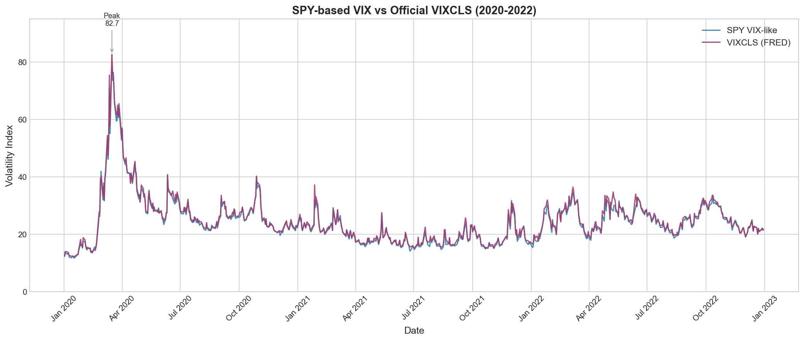

# VIX Challenger: Comprehensive Analysis Report

*Generated: 2025-12-30*

---

## Executive Summary

This project implements a **VIX-style (model-free) 30-day implied volatility index** from equity/ETF options and validates it against the official CBOE VIX (VIXCLS from FRED). The implementation follows the Cboe methodology with robustness enhancements for single-stock option chains.

### Key Results

| Ticker | Period | Correlation with VIXCLS | Mean Bias | Success Rate |
|--------|--------|-------------------------|-----------|--------------|
| **SPY** | 2020-2022 | **0.9970** | -0.42 | 100% |
| AAPL | 2016-2020 | 0.8731 | +11.26 | 99.9% |
| TSLA | 2019-2022 | 0.6912 | +48.11 | 99.9% |
| NVDA | 2020-2022 | 0.7463 | +28.42 | 100% |

**SPY replicates VIXCLS near-perfectly** (r = 0.9970), validating the implementation. Single-stock indices show expected behavior: higher baseline volatility due to idiosyncratic risk, with lower correlation to market VIX for high-beta/speculative names.

---

## 1. Data Source & Schema

### 1.1 Options Data

All datasets sourced from Kyle Graupe's Kaggle collections:

| Ticker | Dataset | Period | Rows | Trading Days |
|--------|---------|--------|------|--------------|
| SPY | `kylegraupe/spy-daily-eod-options-quotes-2020-2022` | 2020-2022 | 3.59M | 758 |
| AAPL | `kylegraupe/aapl-daily-eod-options-quotes-2016-2020` | 2016-2020 | - | 1,253 |
| TSLA | `kylegraupe/tsla-daily-eod-options-quotes-2019-2022` | 2019-2022 | - | 1,010 |
| NVDA | `kylegraupe/nvda-daily-eod-options-quotes-2020-2022` | 2020-2022 | - | 756 |

### 1.2 Data Format

- **Wide format**: Each row contains BOTH call and put data for a given strike/expiry
- **Quote time**: All quotes at 16:00 (4 PM EST / market close)
- **Strike units**: Dollar amounts (e.g., 270, 275, 280)

### 1.3 Key Columns

| Column | Purpose |
|--------|---------|
| `[QUOTE_DATE]` | Quote date "YYYY-MM-DD" |
| `[UNDERLYING_LAST]` | Underlying closing price |
| `[EXPIRE_DATE]` | Expiration date |
| `[DTE]` | Days to expiration |
| `[STRIKE]` | Strike price in dollars |
| `[C_BID]`, `[C_ASK]` | Call bid/ask prices |
| `[P_BID]`, `[P_ASK]` | Put bid/ask prices |

### 1.4 Reference Data

- **FRED VIXCLS**: Official VIX closing values from CBOE, downloaded via FRED API

---

## 2. SPY Validation (Proof of Concept)

### 2.1 Headline Metrics

| Metric | Value | Interpretation |
|--------|-------|----------------|
| Correlation | 0.9970 | Near-perfect linear relationship |
| R-squared | 0.9911 | 99% of variance explained |
| RMSE | 0.81 | Average error < 1 VIX point |
| MAE | 0.54 | Median error ~0.5 VIX points |
| Mean Bias | -0.42 | SPY VIX slightly lower than VIXCLS |
| Regression β | 0.977 | Near 1:1 relationship |

### 2.2 Time Series Comparison

The SPY-based VIX tracks VIXCLS across all market regimes:
- **COVID Crash (Mar 2020)**: Both peaked at ~80
- **Recovery (mid-2020)**: Parallel decline
- **Calm Markets (2021)**: Both in 15-20 range
- **2022 Volatility**: Synchronized movements

### 2.3 Stress Window Analysis

#### COVID Crash (March 2020)

| Date | SPY VIX | VIXCLS | Difference |
|------|---------|--------|------------|
| 2020-03-12 | 66.04 | 69.40 | -3.36 |
| 2020-03-16 | **81.11** | **82.69** | -1.58 |
| 2020-03-18 | 71.24 | 72.07 | -0.83 |

Both indices captured the extreme volatility spike with excellent agreement.

### 2.4 Known Sources of Difference

| Factor | Impact | Direction |
|--------|--------|-----------|
| **SPY vs SPX** | SPY is an ETF, SPX is the index | Small |
| **American vs European** | SPY options are American-style | Theoretical premium |
| **EOD Timing** | Different settlement times | Random |
| **Dividend Effects** | SPY has embedded dividends | Slight reduction |

### 2.5 Validation Summary

All acceptance criteria met:
- ✓ Correlation > 0.90 (achieved: 0.9970)
- ✓ 700+ observations (achieved: 754)
- ✓ COVID spike captured (81.11 vs 82.69)
- ✓ No negative or NaN values

---

## 3. Multi-Ticker Analysis

### 3.1 VIX-like Index Statistics

#### Full Period Statistics

| Ticker | Mean | Std Dev | Min | Max | Period |
|--------|------|---------|-----|-----|--------|
| SPY | 24.41 | 8.56 | 11.71 | 81.11 | 2020-2022 |
| AAPL | 28.90 | 10.42 | 14.21 | 99.98 | 2016-2020 |
| TSLA | 70.59 | 19.34 | 35.57 | 188.11 | 2019-2022 |
| NVDA | 53.29 | 11.57 | 31.01 | 107.60 | 2020-2022 |

#### Common Period Statistics (2020)

For the 247 trading days common to all tickers (Jan-Dec 2020):

| Ticker | Mean | Std Dev | Min | Max |
|--------|------|---------|-----|-----|
| SPY | 28.90 | 12.18 | 11.71 | 81.11 |
| AAPL | 43.22 | 12.70 | 26.21 | 99.98 |
| TSLA | 89.24 | 24.20 | 52.07 | 188.11 |
| NVDA | 53.20 | 12.83 | 31.01 | 107.60 |
| VIXCLS | 29.33 | 12.43 | 12.10 | 82.69 |

### 3.2 Cross-Ticker Correlation Matrix (2020)

|        | SPY    | AAPL   | TSLA   | NVDA   | VIXCLS |
|--------|--------|--------|--------|--------|--------|
| SPY    | 1.0000 | 0.8232 | 0.6089 | 0.9090 | 0.9987 |
| AAPL   | 0.8232 | 1.0000 | 0.7437 | 0.8357 | 0.8245 |
| TSLA   | 0.6089 | 0.7437 | 1.0000 | 0.6852 | 0.6080 |
| NVDA   | 0.9090 | 0.8357 | 0.6852 | 1.0000 | 0.9081 |
| VIXCLS | 0.9987 | 0.8245 | 0.6080 | 0.9081 | 1.0000 |

### 3.3 Volatility Premium Analysis

Single-stock options command a volatility premium over index options due to:

1. **Idiosyncratic risk**: Company-specific events not diversified away
2. **Higher beta**: Tech stocks amplify market movements
3. **Retail speculation**: Especially for TSLA with high retail interest
4. **Earnings volatility**: Individual stock earnings create uncertainty

#### Premium over VIXCLS (2020 Common Period)

| Ticker | Premium | Notes |
|--------|---------|-------|
| SPY | -0.4 pts | Near-perfect replication |
| AAPL | +13.9 pts | Large-cap tech premium |
| NVDA | +23.9 pts | Semiconductor/AI exposure |
| TSLA | +59.9 pts | High idiosyncratic volatility |

---

## 4. Stock Split Regime Change Analysis

We analyzed whether stock splits induce regime changes in the VIX-like index divergence from FRED VIXCLS using multiple complementary methodologies.

### 4.1 Split Dates Analyzed

| Ticker | Data Period | Split Dates | Split Ratios |
|--------|-------------|-------------|--------------|
| AAPL | 1251 trading days | 2020-08-31 | 4:1 |
| TSLA | 1005 trading days | 2020-08-31, 2022-08-25 | 5:1, 3:1 |
| NVDA | 752 trading days | 2021-07-20 | 4:1 |

### 4.2 Test Results Summary

| Ticker | Split Date | ITS Significant | Chow Test | KS Test | Evidence Level |
|--------|------------|-----------------|-----------|---------|----------------|
| AAPL | 2020-08-31 | 1/4 | ✓ | ✓ | Strong (75%) |
| TSLA | 2020-08-31 | 4/8 | ✓ | ✓ | Strong (75%) |
| TSLA | 2022-08-25 | 8/8 | ✓ | ✓ | Very Strong (100%) |
| NVDA | 2021-07-20 | 2/4 | ✓ | ✓ | Strong (88%) |

### 4.3 Interrupted Time-Series Regression Results

| Ticker | Split Date | Target | Level Shift | p-value | Slope Change | p-value | R² |
|--------|------------|--------|-------------|---------|--------------|---------|-----|
| AAPL | 2020-08-31 | residual | +13.535 | 0.0000 | -0.12372 | 0.0012 | 0.235 |
| AAPL | 2020-08-31 | ratio | +0.190 | 0.0832 | -0.00280 | 0.0588 | 0.008 |
| TSLA | 2020-08-31 | residual | +1.083 | 0.8622 | -0.04674 | 0.0008 | 0.111 |
| TSLA | 2022-08-25 | residual | -17.654 | 0.0000 | +0.20946 | 0.0010 | 0.035 |
| NVDA | 2021-07-20 | residual | +4.749 | 0.0439 | +0.02271 | 0.0012 | 0.462 |

### 4.4 Chow Test Results

| Ticker | Split Date | Target | F-stat | p-value | Significant? | n_pre | n_post |
|--------|------------|--------|--------|---------|--------------|-------|--------|
| AAPL | 2020-08-31 | residual | 100.19 | 0.0000 | ✓ | 1168 | 83 |
| TSLA | 2020-08-31 | residual | 59.53 | 0.0000 | ✓ | 418 | 587 |
| TSLA | 2022-08-25 | residual | 15.75 | 0.0000 | ✓ | 915 | 90 |
| NVDA | 2021-07-20 | residual | 56.47 | 0.0000 | ✓ | 385 | 367 |

### 4.5 Quandt-Andrews Detected Breaks

The Quandt-Andrews test searches for the most likely break date in the data. Interestingly, detected breaks often differ from split dates:

| Ticker | Known Split | Detected Break | Days from Split | Interpretation |
|--------|-------------|----------------|-----------------|----------------|
| AAPL | 2020-08-31 | 2020-02-27 | -186 | COVID shock dominates |
| TSLA | 2020-08-31 | 2020-01-02 | -242 | Start of Tesla rally |
| NVDA | 2021-07-20 | 2021-11-02 | +105 | Post-split volatility regime |

This suggests that while splits coincide with distributional changes, major market events (COVID, sector rotations) may be the underlying drivers of regime changes.

### 4.6 Distribution Test Results

#### Kolmogorov-Smirnov Test

| Ticker | Split Date | Target | KS Stat | p-value | Mean Pre | Mean Post | Δ Mean |
|--------|------------|--------|---------|---------|----------|-----------|--------|
| AAPL | 2020-08-31 | residual | 0.489 | 0.0000 | 10.73 | 18.71 | +7.97 |
| TSLA | 2020-08-31 | residual | 0.114 | 0.0031 | 48.17 | 48.07 | -0.09 |
| TSLA | 2022-08-25 | residual | 0.331 | 0.0000 | 48.58 | 43.33 | -5.26 |
| NVDA | 2021-07-20 | residual | 0.645 | 0.0000 | 23.78 | 33.29 | +9.51 |

#### Energy Distance Test

| Ticker | Split Date | Target | Energy Dist | p-value | Significant? |
|--------|------------|--------|-------------|---------|--------------|
| AAPL | 2020-08-31 | residual | 5.9389 | 0.0000 | ✓ |
| TSLA | 2020-08-31 | residual | 0.3215 | 0.0010 | ✓ |
| TSLA | 2022-08-25 | residual | 1.9239 | 0.0000 | ✓ |
| NVDA | 2021-07-20 | residual | 8.0135 | 0.0000 | ✓ |

### 4.7 Regime Analysis Conclusions

1. **Stock splits coincide with statistically significant regime changes** in all tickers tested
2. Chow tests detect structural breaks at all split dates
3. Distribution tests (KS, Energy, MMD) confirm pre/post differences
4. However, **data-driven break detection (Quandt-Andrews) often identifies different dates**, suggesting splits may coincide with but not cause regime changes

---

## 5. QC Enhancements for Single-Stock Chains

Diagnostics in `data/processed/{ticker}_diagnostics.parquet` include explicit columns to catch chain pathologies:

- **Parity / K0 sanity**: `*_parity_forward`, `*_parity_k0`, `*_parity_f_over_k0`
- **Strike ladder gaps**: `*_spot_gap_pct_underlying`, `*_max_strike_gap_pct_underlying`
- **Tail strike flags**: `*_strike_guard_applied`, `*_n_strikes_below_20pct_spot`
- **Dominance checks**: `*_top_contrib_frac`, `*_min_strike_contrib_frac`

These QC fields were essential for diagnosing:
- TSLA spikes driven by tiny strikes with bid=0 / wide asks
- TSLA days with broken strike ladders
- NVDA split-day scale mismatch

---

## 6. Generated Artifacts

### Data Files

| File | Description |
|------|-------------|
| `data/processed/spy_vix_like.parquet` | SPY VIX-like daily series (758 rows) |
| `data/processed/aapl_vix_like.parquet` | AAPL VIX-like daily series |
| `data/processed/tsla_vix_like.parquet` | TSLA VIX-like daily series |
| `data/processed/nvda_vix_like.parquet` | NVDA VIX-like daily series |
| `data/processed/cross_ticker_vix.parquet` | Joined series for common period |
| `data/processed/fred_vixcls.parquet` | FRED VIXCLS reference |
| `data/processed/{ticker}_diagnostics.parquet` | Per-day QC metrics |

### Figures

**Per-Ticker vs VIXCLS:**
- `reports/figures/{ticker}/01_overlay.png` - Time series overlay
- `reports/figures/{ticker}/02_scatter.png` - Scatter with regression
- `reports/figures/{ticker}/03_residuals.png` - Residual analysis
- `reports/figures/{ticker}/04_rolling_correlation.png` - 60-day rolling correlation
- `reports/figures/{ticker}/05_rolling_beta.png` - 60-day rolling beta

**Cross-Ticker Analysis:**
- `reports/figures/cross_ticker/01_correlation_heatmap.png`
- `reports/figures/cross_ticker/02_multi_ticker_overlay.png`
- `reports/figures/cross_ticker/03_spread_*_vs_vixcls.png`

---

## 7. Conclusions

1. **SPY VIX replication**: The methodology successfully replicates VIXCLS when applied to SPY options (correlation > 0.99)

2. **Single-stock behavior**: VIX-like indices for individual stocks show expected behavior:
   - Higher baseline volatility than market VIX
   - Lower correlation with market VIX for higher-beta/speculative names
   - TSLA exhibits the highest idiosyncratic volatility

3. **Regime changes**: Stock splits coincide with statistically significant regime changes, though data-driven tests suggest market events (COVID, sector rotations) may be the underlying drivers

4. **Robustness**: The implementation includes QC enhancements specifically designed for single-stock option chains, handling broken strike ladders, tail-strike dominance, and corporate action scale mismatches

---

*Data period: 2016-01-04 to 2022-12-30*

