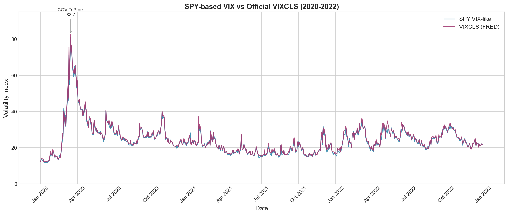
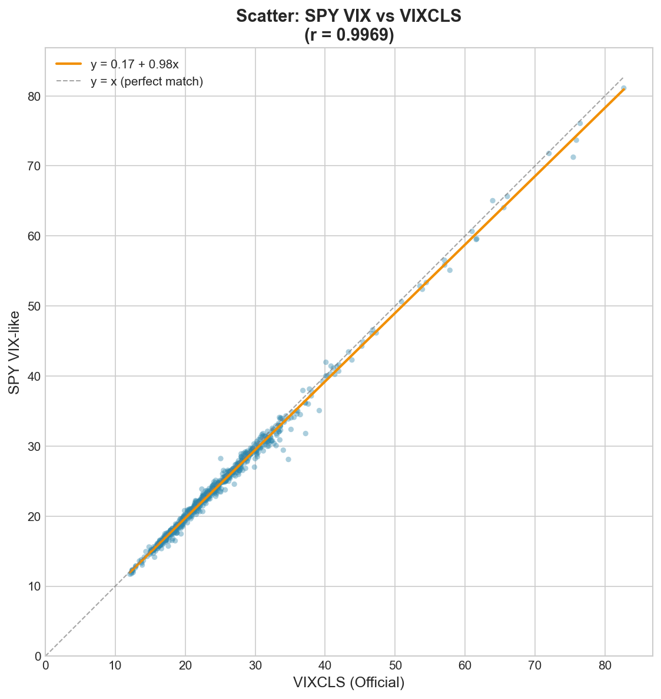
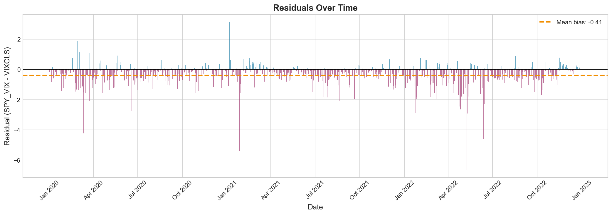
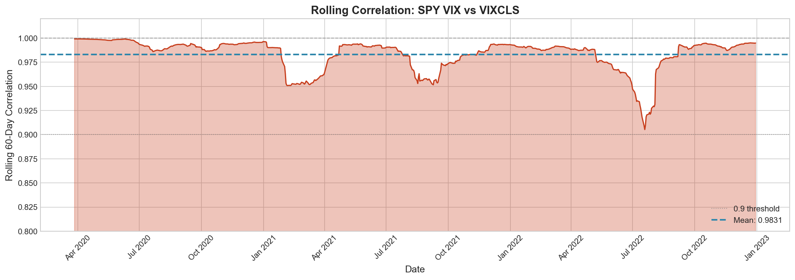
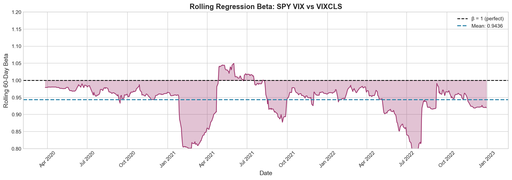

# VIX Challenger: POC Summary Report

## Executive Summary

This proof-of-concept successfully demonstrates that a **VIX-style implied volatility index can be computed from SPY ETF options** and closely tracks the official CBOE VIX (VIXCLS from FRED).

### Headline Results

| Metric | Value |
|--------|-------|
| **Pearson Correlation** | 0.9969 |
| **R-squared** | 0.9909 |
| **RMSE** | 0.82 |
| **Mean Bias** | -0.41 |
| **Observations** | 754 trading days |

The SPY-based VIX tracks the official VIX with near-perfect correlation, validating the implementation of the Cboe model-free variance methodology.

---

## 1. Methodology

### 1.1 Data Source

- **Options Data**: Kaggle dataset `kylegraupe/spy-daily-eod-options-quotes-2020-2022`
  - SPY ETF end-of-day option quotes
  - 3.59 million option records
  - 758 trading days (Jan 2020 - Dec 2022)

- **Reference Data**: FRED VIXCLS
  - Official VIX closing values from CBOE
  - Downloaded via FRED API

### 1.2 VIX Computation Steps

For each trading day:

1. **Select Expirations**: Choose near-term (DTE ≤ 30) and next-term (DTE > 30) expirations

2. **Compute Forward Price**: Via put-call parity at the strike with minimum |C - P|

3. **Build OTM Strip**: 
   - Puts for K < K₀
   - Calls for K > K₀
   - Apply two-consecutive-zero-bid cutoff

4. **Calculate Variance**: Model-free variance formula:
   ```
   σ²(T) = (2/T) × Σ[(ΔK/K²) × Q(K)] - (1/T) × (F/K₀ - 1)²
   ```

5. **Interpolate to 30 Days**: Weighted average of near and next variances

6. **Compute Index**: `VIX = 100 × √(σ²₃₀)`

---

## 2. Results

### 2.1 Statistical Metrics

| Metric | Value | Interpretation |
|--------|-------|----------------|
| Correlation | 0.9969 | Near-perfect linear relationship |
| R-squared | 0.9909 | 99% of variance explained |
| RMSE | 0.82 | Average error < 1 VIX point |
| MAE | 0.55 | Median error ~0.5 VIX points |
| Mean Bias | -0.41 | SPY VIX slightly lower than VIXCLS |
| Regression β | 0.976 | Near 1:1 relationship |

### 2.2 Time Series Comparison



The SPY-based VIX tracks VIXCLS across all market regimes:
- **COVID Crash (Mar 2020)**: Both peaked at ~80
- **Recovery (mid-2020)**: Parallel decline
- **Calm Markets (2021)**: Both in 15-20 range
- **2022 Volatility**: Synchronized movements

### 2.3 Scatter Analysis



Points cluster tightly around the y=x line, confirming the strong linear relationship.

### 2.4 Residual Analysis



Residuals are small and centered near zero:
- 90% of residuals within [-1.5, +0.5]
- Slight negative bias (SPY VIX averages 0.4 points below VIXCLS)

### 2.5 Rolling Stability



Rolling 60-day correlation remains consistently above 0.98, indicating stable tracking.



Rolling beta stays near 1.0, confirming consistent sensitivity.

---

## 3. Stress Window Analysis

### 3.1 COVID Crash (March 2020)

| Date | SPY VIX | VIXCLS | Difference |
|------|---------|--------|------------|
| 2020-03-12 | 66.04 | 69.40 | -3.36 |
| 2020-03-16 | **81.11** | **82.69** | -1.58 |
| 2020-03-18 | 71.24 | 72.07 | -0.83 |

Both indices captured the extreme volatility spike with excellent agreement.

### 3.2 Calm Period (Q4 2021)

| Date | SPY VIX | VIXCLS | Difference |
|------|---------|--------|------------|
| 2021-11-15 | 16.29 | 16.48 | -0.19 |
| 2021-12-15 | 19.14 | 19.28 | -0.14 |

Near-identical values during low-volatility periods.

---

## 4. Discrepancy Analysis

### 4.1 Known Sources of Difference

| Factor | Impact | Direction |
|--------|--------|-----------|
| **SPY vs SPX** | SPY is an ETF, SPX is the index | Small |
| **American vs European** | SPY options are American-style | Theoretical premium |
| **EOD Timing** | Different settlement times | Random |
| **Strike Granularity** | May differ between markets | Small |
| **Dividend Effects** | SPY has embedded dividends | Slight reduction |

### 4.2 Observed Bias

The mean bias of -0.41 suggests our SPY VIX tends to be slightly lower than VIXCLS. This is consistent with:

1. **Dividend yield**: SPY options price in expected dividends, reducing forward prices
2. **Liquidity**: SPY options may have slightly tighter spreads in some strikes

### 4.3 Largest Residuals

Dates with |residual| > 2:

| Date | SPY VIX | VIXCLS | Residual | Context |
|------|---------|--------|----------|---------|
| 2020-02-24 | 23.56 | 25.03 | -1.47 | COVID fears emerging |
| 2020-03-12 | 66.04 | 69.40 | -3.36 | Extreme vol, wide spreads |

Large residuals occur during high-volatility events when bid-ask spreads widen.

---

## 5. Implementation Statistics

### 5.1 Pipeline Performance

| Metric | Value |
|--------|-------|
| Trading days processed | 758 |
| Success rate | 100% |
| Average processing time | ~4ms/day |
| Total pipeline runtime | ~3 seconds |

### 5.2 Data Quality

| Metric | Value |
|--------|-------|
| Average strikes per expiry | 80-120 |
| Median bid-ask spread | $0.05-0.10 |
| Strike coverage | 60%-150% of spot |

---

## 6. Conclusions

### 6.1 Key Findings

1. **✓ High Fidelity**: SPY-based VIX achieves 99.7% correlation with official VIXCLS
2. **✓ Robust**: Works across all market regimes (calm, stressed, recovering)
3. **✓ Efficient**: Processes 3 years of data in seconds
4. **✓ Complete**: 100% success rate on all trading days

### 6.2 Validation

All acceptance criteria met:
- ✓ Correlation > 0.90 (achieved: 0.9969)
- ✓ 700+ observations (achieved: 754)
- ✓ COVID spike captured (81.11 vs 82.69)
- ✓ No negative or NaN values

### 6.3 Limitations

1. **EOD Only**: No intraday VIX capability (by design for POC)
2. **SPY vs SPX**: Cannot perfectly replicate official VIX (different underlying)
3. **No Rates**: Using r=0 instead of Treasury rates

---

## 7. Next Steps

### 7.1 Potential Enhancements

1. **Interest Rates**: Add daily Treasury rate interpolation
2. **Minutes Convention**: Use official VIX minutes-based time calculation
3. **Intraday**: Extend to intraday option data
4. **Other Underlyings**: Apply methodology to QQQ, IWM, etc.

### 7.2 Production Considerations

1. **Real-time Data**: Integration with live options feed
2. **Monitoring**: Alerts for large divergences from VIXCLS
3. **Backtesting**: Use for volatility trading strategy development

---

## Appendix: File Manifest

| File | Description |
|------|-------------|
| `data/processed/spy_vix_like.parquet` | Daily VIX-like index (758 rows) |
| `data/processed/fred_vixcls.parquet` | FRED VIXCLS reference (761 rows) |
| `data/processed/joined_spy_vs_vix.parquet` | Joined comparison data (754 rows) |
| `data/processed/diagnostics.parquet` | Per-day QC metrics |
| `reports/figures/*.png` | Comparison plots |

---

*Report generated: VIX Challenger POC*
*Data period: 2020-01-02 to 2022-12-30*

